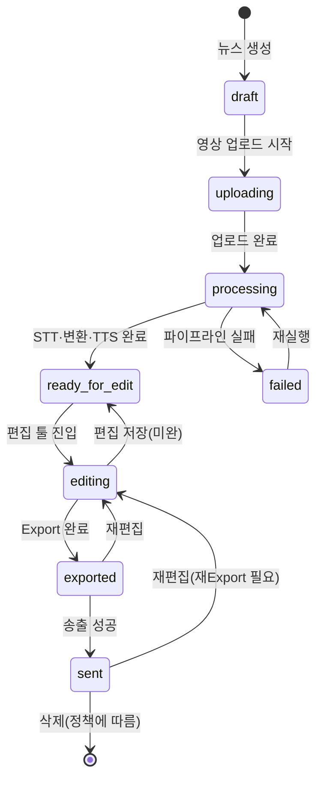

# EasyCast 기능 명세

## 1. 서비스 목적·범위

EasyCast는 뉴스 영상을 업로드한 뒤, 음성 인식(STT)으로 자막을 생성하고, 뉴스 어투의 쉬운말로 변환한 뒤 TTS 더빙을 입혀 편집·검수하고, 최종 영상을 방송/송출 시스템으로 전송하는 **관리자 전용** end-to-end 제작 서비스이다.

### 범위

| 포함 | 제외 (초기) |
|------|-------------|
| 관리자 로그인·세션 관리 | 일반 시청자/공개 포털 |
| 영상 업로드·날짜·뉴스별 관리(CRUD·송출) | 실시간 라이브 송출 |
| STT → 쉬운말 변환 → TTS 자동 더빙 파이프라인 | 수동 더빙 녹음 업로드 |
| 자막·타임라인 편집 툴 | 고급 색보정·다채널 믹싱 |
| 단일 영상 Export | 다언어 자막 동시 제작 |

### 전제

- **사용자**: 관리자 단일 역할
- **더빙**: 쉬운말 변환 후 TTS로 문장별 음성 자동 합성
- **전송**: Export 완료 영상을 방송/송출 시스템(CDN, 방송 MAM, SFTP 등)으로 전달
- **관리 단위**: 방송 **날짜** + **뉴스(제목/회차)**

---

## 2. 운영 워크플로

### 2.1 일일 제작 사이클

1. **등록**: 방송일·뉴스 메타를 등록하고 원본 영상을 업로드한다.
2. **자동 처리**: 백그라운드 작업 큐에서 STT → 쉬운말 변환 → TTS를 순차 실행한다.
3. **검수·편집**: 처리 완료 후 편집 툴에서 자막 위치·길이·속도·쉬운말 재변환을 조정한다.
4. **산출·송출**: Export로 단일 영상을 생성하고, 방송/송출 대상으로 전송한다.
5. **아카이브**: 송출 완료 항목은 날짜·뉴스별로 조회·재송출·삭제가 가능하다.

### 2.2 상태 머신

뉴스 항목(`NewsItem`)은 아래 상태를 가진다.

| 상태 | 설명 |
|------|------|
| `draft` | 메타만 등록, 영상 미업로드 |
| `uploading` | 영상 업로드 진행 중 |
| `processing` | STT / 쉬운말 / TTS 파이프라인 실행 중 |
| `ready_for_edit` | 자동 처리 완료, 편집 대기 |
| `editing` | 편집 툴에서 작업 중 |
| `exported` | 최종 영상 생성 완료 |
| `sent` | 방송/송출 시스템 전송 완료 |
| `failed` | 처리·Export·송출 중 오류 |

### 2.3 실패·재시도 정책

| 단계 | 실패 시 동작 | 재시도 |
|------|-------------|--------|
| 업로드 | 중단 지점부터 재개(청크 업로드) | 사용자 수동 재시도 |
| STT | `failed`, 오류 메시지·로그 저장 | 단계별 재실행 버튼 |
| 쉬운말 변환 | `failed`, 실패 세그먼트 표시 | 전체 또는 실패 구간만 재실행 |
| TTS | `failed`, 미합성 세그먼트 표시 | 실패 세그먼트만 재합성 |
| Export | `editing` 유지, ExportJob 실패 기록 | Export 재시도 |
| 송출 | `exported` 유지, DeliveryJob 실패 기록 | 재전송 |

---

## 3. 기능 목록 (모듈별)

### 3.1 인증

| ID | 기능 | 설명 |
|----|------|------|
| AUTH-01 | 관리자 로그인 | ID/비밀번호 인증 |
| AUTH-02 | 세션·토큰 관리 | JWT 또는 세션 쿠키, 만료 처리 |
| AUTH-03 | 로그아웃 | 세션 무효화 |
| AUTH-04 | 접근 제어 | 미인증 사용자는 모든 관리 기능 차단 |

### 3.2 뉴스·영상 관리

| ID | 기능 | 설명 |
|----|------|------|
| MGT-01 | 뉴스 생성 | 방송일, 뉴스 제목, 메모 등록 |
| MGT-02 | 뉴스 목록 조회 | 날짜·상태·제목 필터·검색 |
| MGT-03 | 뉴스 상세 조회 | 메타, 처리 상태, 편집·송출 이력 |
| MGT-04 | 뉴스 편집 | 제목·메모·방송일 수정(송출 전) |
| MGT-05 | 뉴스 삭제 | 소프트 삭제 기본, 송출 완료 항목은 보관 정책 적용 가능 |
| MGT-06 | 날짜별 그룹핑 | 캘린더/날짜 탭으로 뉴스 묶음 조회 |

### 3.3 업로드

| ID | 기능 | 설명 |
|----|------|------|
| UPL-01 | 영상 파일 업로드 | MP4, MOV 등 지원 포맷(방송 규격 설정 가능) |
| UPL-02 | 대용량·재개 업로드 | 청크 업로드, 네트워크 끊김 시 재개 |
| UPL-03 | 업로드 진행률 | 퍼센트·속도·예상 잔여 시간 표시 |
| UPL-04 | 메타 연동 | 업로드와 동시에 방송일·뉴스 ID 연결 |
| UPL-05 | 업로드 검증 | 코덱·해상도·길이 사전 검사(경고/거부 정책) |

### 3.4 음성·자막 생성 (STT)

| ID | 기능 | 설명 |
|----|------|------|
| STT-01 | 오디오 추출 | 영상에서 음성 트랙 분리(FFmpeg 등) |
| STT-02 | 음성 인식 | 외부 STT API 또는 자체 엔진 연동 |
| STT-03 | 자막 파일 생성 | SRT/VTT 형식, 타임코드(in/out) 포함 |
| STT-04 | 세그먼트 분리 | 문장·발화 단위 `SubtitleSegment` 생성 |
| STT-05 | 원문 보존 | STT 결과를 `originalText`로 불변 저장 |

### 3.5 쉬운말 변환

쉬운말 변환은 내부적으로 **쉬운말 변환 API**를 호출하여 수행한다. 파이프라인 일괄 변환과 편집 툴에서의 문장 단위 재변환 모두 동일 API를 사용한다.

| ID | 기능 | 설명 |
|----|------|------|
| EZ-01 | 뉴스 어투 쉬운말 변환 | 쉬운말 변환 API 호출, 뉴스 앵커 톤 유지 |
| EZ-02 | 문장 단위 변환 | 세그먼트별 `originalText`를 API에 전달해 `easyText` 생성 |
| EZ-03 | 원문 대비 보존 | `originalText`와 `easyText` 쌍 유지 |
| EZ-04 | 수동 수정 | 편집 툴에서 `easyText` 직접 편집 가능 |
| EZ-05 | 특정 문장 재변환 | 선택 세그먼트에 대해 쉬운말 변환 API를 재호출해 `easyText` 갱신 |
| EZ-06 | 짧게 출력 재변환 | 재변환 시 API 옵션(예: `shortOutput`)을 적용해 **원문보다 짧은** `easyText`를 생성 |

### 3.6 TTS 더빙

| ID | 기능 | 설명 |
|----|------|------|
| TTS-01 | 문장별 음성 합성 | `easyText` 기준 TTS API 호출 |
| TTS-02 | 구간 길이 참고 | 원 STT 구간 길이를 합성·후처리 참고값으로 사용 |
| TTS-03 | 오디오 자산 저장 | 세그먼트별 `ttsAudioRef` (파일 경로/URL) |
| TTS-04 | 재합성 | 텍스트·속도 변경 후 해당 세그먼트만 TTS 재생성 |
| TTS-05 | 미리듣기 지원 | 편집 툴에서 세그먼트 단위 TTS 재생 |

### 3.7 편집 툴

| ID | 기능 | 설명 |
|----|------|------|
| ED-01 | 자막 오버레이 미리보기 | 변환 자막을 영상 위에 실시간 표시 |
| ED-02 | 자막 보이기/안보이기 | 프리뷰·타임라인에서 자막 오버레이 표시 여부 토글(편집·Export 설정과 별도) |
| ED-03 | 위치 조정 | 세그먼트별 x, y (또는 앵커·마진) 조정 |
| ED-04 | 길이 조정 | in/out 타임코드 드래그·입력으로 표시 구간 변경 |
| ED-05 | 구간 속도 조절 | 문장 단위 재생 속도 **1.0 ~ 1.1배** (상한 1.1) |
| ED-06 | 속도-길이 맞춤 | 쉬운말+TTS가 원 구간보다 길 때 속도 상향으로 원 길이에 근접 |
| ED-07 | 쉬운말 재변환 | 선택 세그먼트에 대해 쉬운말 변환 API 재호출(EZ-05, EZ-06) |
| ED-08 | 임의 위치 재생 | playhead seek, 스크럽 지원 |
| ED-09 | 더빙 동기 재생 | TTS 오디오와 영상(및 자막) 동기 재생 |
| ED-10 | 비파괴 편집 | 원본 영상·STT·초기 변환본 보존, 편집은 프로젝트 레이어에 저장 |
| ED-11 | 타임라인 UI | 영상·자막 블록·TTS 웨이브폼 트랙 |
| ED-12 | 자동 저장·되돌리기 | 편집 이력 스냅샷, undo/redo |

### 3.8 Export

| ID | 기능 | 설명 |
|----|------|------|
| EXP-01 | 단일 영상 출력 | 편집 결과를 1개 파일로 병합 |
| EXP-02 | 자막 반영 | burn-in(화면 합성) 또는 soft subtitle mux |
| EXP-03 | 더빙 오디오 믹스 | TTS 트랙을 타임라인에 맞춰 영상에 합성 |
| EXP-04 | 속도 보정 반영 | 세그먼트별 speed(≤1.1)를 최종 렌더에 적용 |
| EXP-05 | 방송 프리셋 | 해상도·코덱·비트레이트 프리셋 선택 |
| EXP-06 | Export 작업 큐 | 비동기 렌더, 진행률·완료 알림 |
| EXP-07 | 결과물 다운로드 | 로컬 저장 또는 스토리지 URL 제공 |

### 3.9 송출 (방송/송출 연동)

| ID | 기능 | 설명 |
|----|------|------|
| DEL-01 | 송출 대상 선택 | 설정된 방송 채널·CDN·MAM 대상 목록 |
| DEL-02 | 영상 전송 | Export 파일을 방송/송출 시스템으로 업로드·푸시 |
| DEL-03 | 전송 이력 | 시각, 대상, 결과, 담당자 기록 |
| DEL-04 | 재전송 | 실패·정정 시 동일 또는 새 Export로 재송출 |
| DEL-05 | 송출 전 확인 | Export 미리보기·메타 확인 단계(권장) |
| DEL-06 | 어댑터 플러그 | CDN API, SFTP, 방송 MAM API 등 대상별 어댑터 |

---

## 4. 편집 툴 상세 동작

### 4.1 자막 위치·길이

- 프리뷰 화면에서 자막 박스를 드래그해 위치를 조정한다.
- 타임라인에서 자막 블록의 좌·우 핸들을 드래그해 in/out을 변경한다.
- 숫자 입력으로 프레임/초 단위 정밀 조정을 지원한다.

### 4.2 속도 조절 (최대 1.1배)

- 쉬운말 문장과 TTS가 원 발화 구간보다 길어질 때, 해당 구간의 **재생 속도**를 1.0~1.1 범위에서 올려 타임라인상 원 구간 길이와 맞춘다.
- UI는 속도 슬라이더와 “원 구간 길이에 맞추기” 자동 제안을 제공한다.
- 1.1배로도 맞지 않으면 **쉬운말 변환 API 재호출(짧게 출력 옵션)** 을 권장한다(§4.3).

### 4.3 문장 재변환 (짧게 출력)

- 한 세그먼트의 `easyText`가 화면·시간 제약을 초과하면, 해당 세그먼트의 `originalText`로 **쉬운말 변환 API를 재호출**한다.
- 재호출 시 **원문보다 짧게 출력**하는 옵션(EZ-06)을 적용한다. 문장을 분할하거나 자르지 않으며, 단일 세그먼트 내에서 더 짧은 `easyText`로 치환한다.
- 관리자가 재변환 결과를 확인·수락하면 `easyText`가 갱신되고, 해당 세그먼트 TTS 재합성이 수행된다.
- 일반 재변환(EZ-05, 짧게 출력 옵션 없음)과 짧게 출력 재변환(EZ-06)을 편집 툴에서 선택할 수 있다.

### 4.4 미리보기·재생

- 타임라인 또는 프리뷰 바에서 임의 시점으로 seek 가능하다.
- 재생 시 영상 + 해당 시점의 TTS 더빙 + 자막 오버레이가 동기 재생된다.
- 일반 영상 편집 툴과 동일하게 재생/일시정지, 프레임 전진/후진(선택)을 지원한다.

---

## 5. 비기능·운영 요구

| 영역 | 요구사항 |
|------|----------|
| 성능 | 대용량 영상(수 GB) 업로드·처리, 작업 큐 기반 비동기 파이프라인 |
| 가용성 | 처리·Export·송출 작업 상태 영속화, 재시작 후 작업 복구 |
| 보안 | 관리자 인증, 업로드·Export URL 서명, 송출 자격 증명 암호화 저장 |
| 감사 | 로그인, 편집 저장, Export, 송출 이벤트 감사 로그 |
| 방송 규격 | 해상도(예: 1920×1080), 코덱(H.264/H.265), 자막 safe area 설정 |
| 모니터링 | 파이프라인·Export·송출 실패 알림(이메일/슬랙 등, 선택) |

---

## 6. 외부 연동 (개념)

| 연동 | 역할 |
|------|------|
| STT API | 음성 → 텍스트·타임코드 |
| 쉬운말 변환 API | 뉴스 어투 쉬운말 변환·문장 단위 재변환(짧게 출력 옵션 포함) |
| TTS API | 쉬운말 텍스트 → 음성 합성 |
| FFmpeg(또는 동등) | 오디오 추출, 속도 변경, 자막 burn-in, mux |
| 송출 어댑터 | CDN 업로드, SFTP, 방송 MAM/Playout API |
| 객체 스토리지 | 원본·중간·Export 파일 보관 |

### 권장 기술 스택 (참고)

- 관리 UI: Next.js 등 SPA/SSR
- API·작업 큐: NestJS + Redis/Bull 등
- 미디어 처리: FFmpeg 워커
- 구현 상세는 별도 아키텍처 문서에서 정의

---

## 7. 데이터 모델 (개념)

### NewsItem

| 필드 | 설명 |
|------|------|
| id | 고유 ID |
| broadcastDate | 방송일 |
| title | 뉴스 제목 |
| status | 상태 머신 값 |
| memo | 관리자 메모 |
| createdAt, updatedAt | 생성·수정 시각 |
| createdBy | 담당 관리자 |

### VideoAsset

| 필드 | 설명 |
|------|------|
| id | 고유 ID |
| newsItemId | 소속 뉴스 |
| sourcePath | 원본 파일 경로 |
| duration | 영상 길이(초) |
| width, height | 해상도 |
| codec | 코덱 정보 |

### SubtitleSegment

| 필드 | 설명 |
|------|------|
| id | 고유 ID |
| newsItemId | 소속 뉴스 |
| order | 타임라인 순서 |
| startTime, endTime | 원 구간 in/out |
| originalText | STT 원문 |
| easyText | 쉬운말 변환문 |
| positionX, positionY | 자막 위치 |
| displayStart, displayEnd | 화면 표시 구간(편집 후) |
| speed | 재생 속도 (1.0~1.1) |
| ttsAudioRef | TTS 오디오 파일 참조 |
| subtitleVisible | 자막 오버레이 표시 여부(편집 툴·프리뷰용) |

### EditProject

| 필드 | 설명 |
|------|------|
| id | 고유 ID |
| newsItemId | 소속 뉴스 |
| segments | 편집된 세그먼트 스냅샷(JSON) |
| version | 편집 버전 |
| savedAt | 마지막 저장 시각 |

### ExportJob

| 필드 | 설명 |
|------|------|
| id | 고유 ID |
| newsItemId | 소속 뉴스 |
| status | pending / running / completed / failed |
| outputPath | Export 파일 경로 |
| preset | 인코딩 프리셋 |
| startedAt, completedAt | 시작·완료 시각 |

### DeliveryJob

| 필드 | 설명 |
|------|------|
| id | 고유 ID |
| exportJobId | 전송할 Export |
| targetId | 송출 대상(채널/CDN 등) |
| status | pending / sent / failed |
| sentAt | 전송 완료 시각 |
| sentBy | 전송 실행 관리자 |
| externalRef | 방송 시스템 측 ID(있을 경우) |

---

## 8. first.md 요구사항 매핑

| first.md 요구 | 본 문서 대응 |
|---------------|-------------|
| 관리자 로그인 | §3.1 인증 |
| 영상 업로드 | §3.3 업로드 |
| 음성 추출·자막 생성 | §3.4 STT |
| 쉬운말 변환 | §3.5 쉬운말 변환 |
| 자막 입혀 테스트 편집 툴 | §3.7 ED-01, §4 |
| 자막별 위치·길이 조정 | §3.7 ED-03, ED-04, §4.1 |
| 속도 최대 1.1배 | §3.7 ED-05, ED-06, §4.2 |
| 긴 문장 재치환 | §3.5 EZ-06, §3.7 ED-07, §4.3 |
| 더빙 재생 | §3.7 ED-09, §4.4 |
| Export | §3.8 Export |
| 날짜·뉴스별 관리 | §3.2 뉴스·영상 관리 |
| 생성·편집·삭제·전송 | §3.2 MGT, §3.9 송출 |
