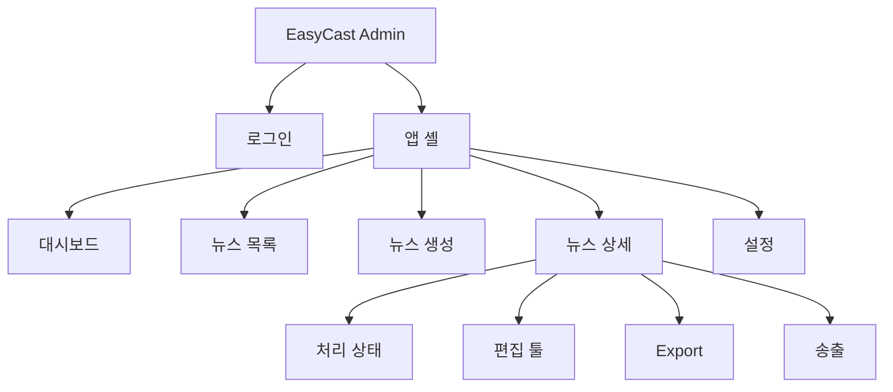

# EasyCast UI 설계

## 1. 개요

본 문서는 [function.md](function.md)에 정의된 기능을 바탕으로 **관리자 전용** EasyCast 웹 UI의 정보 구조, 화면 구성, 편집 툴 레이아웃, 사용자 플로우를 정의한다.

### 설계 전제

| 항목 | 내용 |
|------|------|
| 사용자 | 관리자 단일 역할 |
| 더빙 | 쉬운말 변환 후 TTS 자동 생성 |
| 전송 | Export 완료 영상을 방송/송출 시스템으로 전송 |
| 관리 단위 | 방송 날짜 + 뉴스(제목) |
| 디바이스 | 데스크톱 우선(타임라인·넓은 프리뷰), 태블릿 최소 지원 |

---

## 2. 정보 구조 (IA)



### 글로벌 네비게이션

- **상단 바**: 로고, 현재 방송일 빠른 전환, 사용자 메뉴(로그아웃)
- **좌측 사이드바**: 대시보드, 뉴스 목록, 뉴스 생성, 설정(송출 대상·프리셋)

---

## 3. 화면별 설계

### 3.1 로그인

**목적**: 관리자 인증

**레이아웃**

```
┌─────────────────────────────────────┐
│            EasyCast 로고             │
│  ┌─────────────────────────────┐   │
│  │ ID                           │   │
│  │ 비밀번호                      │   │
│  │ [ 로그인 ]                    │   │
│  │ (오류: 인증 실패 메시지)       │   │
│  └─────────────────────────────┘   │
└─────────────────────────────────────┘
```

| 요소 | 동작 |
|------|------|
| ID / 비밀번호 입력 | 필수, Enter로 로그인 |
| 로그인 버튼 | 성공 시 대시보드로 이동 |
| 오류 메시지 | 인증 실패 시 인라인 표시 |

---

### 3.2 대시보드

**목적**: 오늘(또는 선택일) 작업 현황 한눈에 파악

**주요 UI**

- **날짜 선택기**: 방송일 캘린더/드롭다운
- **상태 카드**: 처리 중 / 편집 대기 / Export 완료 / 송출 완료 / 실패 건수
- **최근 뉴스 테이블**: 제목, 상태 배지, 마지막 수정, 빠른 액션(편집·송출)
- **CTA**: `+ 새 뉴스 만들기`

---

### 3.3 뉴스 목록

**목적**: 날짜·뉴스별 관리(조회·생성·삭제·송출 진입)

**주요 UI**

| 영역 | 구성 |
|------|------|
| 필터 바 | 방송일 범위, 상태, 제목 검색 |
| 테이블 | 방송일, 제목, 상태 배지, 영상 길이, 담당자, 수정일 |
| 행 액션 | 상세, 편집 툴, Export, 송출, 삭제 |
| 상단 CTA | `+ 뉴스 생성` |

**상태 배지 색상 (예시)**

- `processing` — 파랑
- `ready_for_edit` — 노랑
- `editing` — 주황
- `exported` — 초록
- `sent` — 회색
- `failed` — 빨강

---

### 3.4 뉴스 생성

**목적**: 새 뉴스 항목 등록 및 영상 업로드

**폼 필드**

| 필드 | 필수 | 설명 |
|------|------|------|
| 방송일 | O | date picker |
| 뉴스 제목 | O | 텍스트 |
| 메모 | X | textarea |
| 영상 파일 | O | 드래그앤드롭 + 파일 선택 |

**업로드 UI**

- 진행률 바, 업로드 속도, 취소 버튼
- 완료 시 자동으로 **뉴스 상세(처리 상태)** 화면으로 이동

---

### 3.5 뉴스 상세 · 처리 상태

**목적**: 파이프라인 모니터링 및 다음 단계 진입

**레이아웃**

```
┌─ 뉴스 메타 (제목, 방송일, 상태) ─────────────────────────┐
│  [편집 툴 열기]  [Export]  [송출]  (상태에 따라 활성/비활성) │
├─ 처리 파이프라인 ─────────────────────────────────────────┤
│  ✓ 업로드 완료                                             │
│  ● STT 진행 중 ████████░░ 80%                              │
│  ○ 쉬운말 변환 대기                                         │
│  ○ TTS 더빙 대기                                           │
├─ 실패 시 ─────────────────────────────────────────────────┤
│  오류 메시지 + [단계 재실행]                                │
└───────────────────────────────────────────────────────────┘
```

| 단계 | UI 표시 |
|------|---------|
| STT | 진행률, 예상 잔여 시간(가능 시) |
| 쉬운말 변환 | 완료 세그먼트 수 / 전체 |
| TTS | 완료 세그먼트 수 / 전체 |
| 전체 완료 | `편집 툴 열기` 버튼 활성화 |

**탭 구조 (상세 하위)**

- 개요(처리 상태) — 기본
- 편집 툴 — 전체 화면 또는 새 탭
- Export
- 송출 이력

---

### 3.6 편집 툴 (핵심)

**목적**: multi-track 타임라인 기반 자막·오디오(화자·BGM) 편집, 볼륨·레벨링, 쉬운말 재변환, 동기 재생

#### 레이아웃 (상단 2열 + 하단 multi-track)

```
┌─ 툴바 ─────────────────────────────────────────────────────────────┐
│ ← 뉴스 상세 | 저장 | undo/redo | 자막☑ | [레벨 자동 맞추기] | Export | 송출 │
├──────────────────────┬───────────────────────────────────────────┤
│  [작은 프리뷰 ~480px] │  우측 인스펙터 (탭)                         │
│  KBS 영상+자막        │  [텍스트] [오디오] [트랙]                    │
│  ▶ ⏸ seek            │  (선택 클립/트랙에 따라 내용 변경)            │
├──────────────────────┴───────────────────────────────────────────┤
│ Multi-track Timeline (높이 확대, 스크롤)                            │
│ ┌Track──┬──────────────────────────────────────────────────────┐ │
│ │ Video │ ████████████████████████████████████████████████████ │ │
│ │ Sub   │ [blk1][blk2────][blk3]...                            │ │
│ │ Spk A │ ∿∿∿ [clip] ∿∿∿∿ [clip] ∿∿∿                           │ │
│ │ Spk B │      ∿∿ [clip] ∿∿∿∿                                  │ │
│ │ BGM   │ ░░░░░░░░░░░░░░░░░░░░░░░░░░░░░░░░░░░░░░░░░░░░░░░░░░░░ │ │
│ └───────┴──────────────────────────────────────────────────────┘ │
│ Playhead ▲  |  마스터 vol [━━●━━]  -16 LUFS                      │
└──────────────────────────────────────────────────────────────────┘
```

- **프리뷰**: `max-width: 480px`, `aspect-ratio: 16/9`, 상단 좌측 고정
- **타임라인**: 좌측 트랙 헤더(이름, mute/solo, 트랙 vol) + 우측 클립 레인
- **우측 패널**: 위치 X/Y, In/Out **숫자 입력 필드 없음** — 타임라인 trim·프리뷰 드래그로만 조정

#### 트랙 표기 규칙

| 트랙 타입 | 라벨 예 | 색상(예) |
|-----------|---------|----------|
| Video | Video | 회색 |
| Subtitle | Subtitle | 파랑 |
| Speaker | 화자 A (앵커) / 화자 B (리포터) — **쉬운말 TTS 적용 클립** | 주황·초록 |
| Background | BGM / 배경음 | 보라 |

> 화자 트랙은 TTS 합성 결과를 담는다. 별도 TTS 트랙은 두지 않는다.

#### 우측 인스펙터 (탭형)

**탭 1: 텍스트**

- 세그먼트 메타(번호, 타임코드 읽기 전용)
- 원문 / 쉬운말 textarea
- 속도 슬라이더 (1.0~1.1)
- [원 구간 길이에 맞추기], [쉬운말 재변환], [짧게 출력 재변환], [TTS 미리듣기]

**탭 2: 오디오**

- **클립 볼륨** 슬라이더 (선택 문장)
- **트랙 fader** (선택 트랙)
- **마스터 볼륨** + 목표 LUFS 표시
- [레벨 자동 맞추기] / [선택 트랙만]
- 간이 VU 미터

**탭 3: 트랙**

- 트랙 목록 (타입 배지, mute/solo 토글)
- 화자 ↔ 트랙 매핑 (드롭다운)
- BGM 트랙 on/off, ducking 옵션(체크, 향후)
- 세그먼트 목록 네비게이션 (↑↓ 빠른 이동)

#### 패널별 상호작용

| 영역 | 상호작용 |
|------|----------|
| 툴바 자막 보이기 | 프리뷰·타임라인 자막 오버레이 on/off |
| 툴바 레벨 자동 맞추기 | 전체/선택 트랙 LUFS·peak 정규화 |
| 비디오 프리뷰 | 자막 드래그 → 위치; 클릭 → 세그먼트 선택 |
| 시크 바 | seek; 스크럽 시 multi-track 오디오 프리뷰 |
| 인스펙터 텍스트 탭 | 원문·쉬운말·속도·재변환 (위치/in/out 필드 없음) |
| 인스펙터 오디오 탭 | 클립·트랙·마스터 볼륨, VU, 레벨링 |
| 인스펙터 트랙 탭 | 트랙 mute/solo, 화자 매핑, 세그먼트 목록 |
| Multi-track 타임라인 | 트랙별 클립 선택·trim·드래그; 트랙 헤더 mute/solo/vol |
| 쉬운말 재변환 | API 재호출 → 미리보기 → 적용 시 TTS 재합성 |

#### 단축키 (권장)

| 키 | 동작 |
|----|------|
| Space | 재생/일시정지 |
| ← / → | 1초(또는 1프레임) 이동 |
| ↑ / ↓ | 이전/다음 자막 세그먼트 |
| M | 선택 트랙 mute |
| S | 선택 트랙 solo |
| Ctrl+S | 저장 |
| Ctrl+Z / Ctrl+Y | 되돌리기 / 다시실행 |

#### 쉬운말 재변환 모달

`[쉬운말 재변환]` 또는 `[짧게 출력 재변환]` 클릭 시:

```
┌─ 쉬운말 재변환 ─────────────────────────────┐
│ 원문: (STT originalText)                    │
│ ─────────────────────────────────────────  │
│ 변환 결과: (API 응답 easyText, 편집 가능)    │
│ ☑ 짧게 출력 (짧게 출력 재변환 시 기본 체크)   │
│ [다시 요청]  [취소]  [적용]                  │
└────────────────────────────────────────────┘
```

- **적용** 시 `easyText` 갱신 및 해당 세그먼트 TTS 재합성 트리거

#### 선택 동기화

- 타임라인 클립 선택 ↔ 프리뷰 자막 하이라이트 ↔ 인스펙터 탭 필드 동기화
- 재생 중 playhead 경과 세그먼트 자동 하이라이트

---

### 3.7 Export

**목적**: 편집본을 단일 영상으로 출력

**UI 구성**

| 요소 | 설명 |
|------|------|
| 프리셋 선택 | 해상도, 코덱, 비트레이트(방송 규격) |
| 미리보기 | 짧은 구간 또는 전체 스트리밍 미리보기(선택) |
| Export 실행 | 비동기 작업 시작 |
| 진행률 | 렌더 %, 예상 완료 시간 |
| 완료 | 다운로드 링크, `송출` CTA 활성화 |

**진입 경로**

- 뉴스 상세 탭
- 편집 툴 툴바 `Export` 버튼

---

### 3.8 송출

**목적**: 방송/송출 시스템으로 Export 영상 전송

**UI 구성**

| 요소 | 설명 |
|------|------|
| Export 선택 | 최신 Export 기본 선택, 이전 버전 선택 가능 |
| 송출 대상 | 드롭다운(채널 A CDN, MAM, SFTP 등) |
| 메타 확인 | 방송일, 제목, 파일 길이·크기 |
| 미리보기 | 송출 전 필수 확인 체크박스 |
| 전송 실행 | `방송 시스템으로 전송` 버튼 |
| 이력 테이블 | 일시, 대상, 결과, 담당자, [재전송] |

**상태 표시**

- 전송 중: 스피너 + 진행
- 성공: `sent` 배지, 외부 참조 ID 표시
- 실패: 오류 메시지 + 재전송

---

### 3.9 설정 (관리)

**목적**: 송출 대상·Export 프리셋·TTS 음색 등 운영 설정(초기 간소화 가능)

- 송출 대상 URL/자격 증명(마스킹)
- 기본 Export 프리셋
- TTS 보이스·속도 기본값

---

## 4. 주요 사용자 플로우

### 4.1 신규 뉴스 제작 → 송출

```mermaid
sequenceDiagram
  participant Admin as 관리자
  participant Login as 로그인
  participant Create as 뉴스생성
  participant Pipeline as 처리상태
  participant Editor as 편집툴
  participant Export as Export
  participant Send as 송출

  Admin->>Login: 로그인
  Login->>Create: 대시보드에서 새 뉴스
  Admin->>Create: 메타 입력·영상 업로드
  Create->>Pipeline: 업로드 완료 후 이동
  Pipeline-->>Admin: STT·쉬운말·TTS 진행 표시
  Pipeline->>Editor: 처리 완료·편집 툴 진입
  Admin->>Editor: multi-track·볼륨·속도·쉬운말 재변환 조정·저장
  Editor->>Export: Export 실행
  Export-->>Admin: 완료·다운로드
  Admin->>Send: 대상 선택·전송
  Send-->>Admin: 송출 완료
```

1. 로그인 → 대시보드에서 방송일 확인
2. **뉴스 생성** → 영상 업로드
3. **처리 상태** 화면에서 파이프라인 완료 대기
4. **편집 툴** → multi-track·볼륨·자막·속도·쉬운말 재변환 조정 → 저장
5. **Export** → 단일 영상 생성
6. **송출** → 방송 시스템 전송

### 4.2 실패 복구

1. 뉴스 상세에서 `failed` 단계 확인
2. 오류 메시지 확인 후 **단계 재실행**
3. `ready_for_edit` 도달 후 편집 툴 진입

### 4.3 재편집·재송출

1. 뉴스 목록에서 `sent` 항목 선택
2. 편집 툴에서 수정 → 저장
3. Export 재실행 → 송출 패널에서 **재전송**

### 4.4 삭제

1. 뉴스 목록 행 액션 → 삭제
2. 확인 모달(송출 완료 항목은 경고 문구 강화)
3. 소프트 삭제 후 목록에서 제외(정책에 따라 보관함 표시)

---

## 5. UI 원칙

| 원칙 | 설명 |
|------|------|
| 데스크톱 우선 | multi-track 타임라인·인스펙터는 최소 1280px 너비 가정 |
| Multi-track 우선 | 화자(TTS 적용)·BGM 트랙 분리 표기, NLE 스타일 편집 |
| 오디오 레벨링 | 클립·트랙·마스터 볼륨 + 자동 레벨 맞추기 제공 |
| 상태 가시성 | 처리·Export·송출 중 명확한 진행·완료·실패 표시 |
| 비파괴 편집 | 원문·초기 변환본은 읽기 전용 탭/접기로 유지 |
| 자동 저장 | 편집 툴 주기적 자동 저장, 미저장 이탈 경고 |
| 송출 안전장치 | Export 미리보기·확인 체크 없이 전송 버튼 비활성 |
| 자막 표시 토글 | 툴바에서 자막 on/off; 영상·오디오만 확인할 때 사용, Export 설정과 별도 |
| 접근성 | 키보드 단축키, 포커스 링, 자막 safe area 가이드 오버레이(선택) |
| 일관된 CTA | 생성·편집·삭제·전송은 목록·상세·툴바에서 동일 라벨 사용 |

---

## 6. first.md 요구사항 매핑

| first.md 요구 | UI 대응 |
|---------------|---------|
| 관리자 로그인 | §3.1 로그인 |
| 영상 업로드 | §3.4 뉴스 생성 |
| 음성→자막 | §3.5 처리 상태(STT 단계) |
| 쉬운말 변환 | §3.5(변환 단계) + §3.6 인스펙터 텍스트 탭 |
| 자막 테스트 편집 툴 | §3.6 편집 툴 전체 |
| 위치·길이 조정 | §3.6 프리뷰 드래그, Subtitle 트랙 trim |
| 속도 최대 1.1배 | §3.6 텍스트 탭 속도 슬라이더 |
| 긴 문장 재치환 | §3.6 [쉬운말 재변환]·[짧게 출력 재변환] |
| 더빙 재생 | §3.6 재생·multi-track(화자·BGM) |
| Export | §3.7 Export |
| 날짜·뉴스별 관리 | §3.2 뉴스 목록, §3.2 날짜 필터 |
| 생성·편집·삭제·전송 | §3.4 생성, §3.6·§3.5 편집, §3.3 삭제, §3.8 송출 |

---

## 7. 화면–기능 대응표

| 화면 | function.md 모듈 |
|------|----------------|
| 로그인 | 인증 |
| 대시보드·뉴스 목록 | 뉴스·영상 관리 |
| 뉴스 생성 | 업로드 |
| 처리 상태 | STT, 쉬운말, TTS |
| 편집 툴 | 편집 툴 |
| Export | Export |
| 송출 | 송출 |
